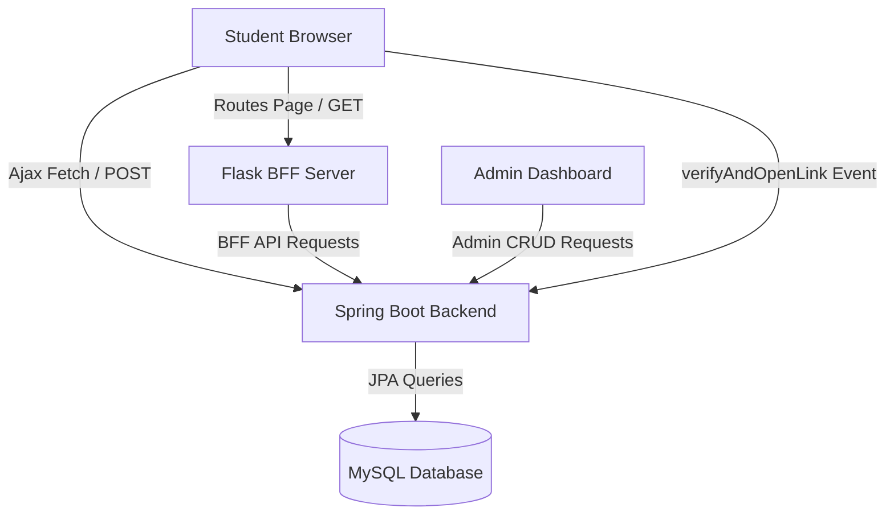

# 🚀 YARD: Youth Academic & Resource Directory

> A secure, full-stack directory and opportunity management portal for students, academic institutions, and employers. Equipped with an automated link verification scanner and secure browser logging interceptors.

---

[](https://spring.io/projects/spring-boot)
[](https://flask.palletsprojects.com/)
[](https://www.mysql.com/)
[](https://www.oracle.com/java/)
[](https://www.python.org/)
[](LICENSE)

---

## 📋 Table of Contents

1. [Project Overview](#-project-overview)
2. [Problem Statement](#-problem-statement)
3. [Key Features](#-key-features)
4. [Tech Stack](#-tech-stack)
5. [System Architecture](#-system-architecture)
6. [Folder Structure](#-folder-structure)
7. [Installation & Setup](#-installation--setup)
8. [Database Configuration](#-database-configuration)
9. [API Documentation](#-api-documentation)
10. [Security & Performance](#-security--performance)
11. [Roadmap](#-roadmap)
12. [Troubleshooting & FAQ](#-troubleshooting--faq)
13. [Contributors & License](#-contributors--license)

---

## 🔍 Project Overview

**YARD (Youth Academic & Resource Directory)** is a secure, decentralized guidance portal designed to bridge the gap between students, educators, and organizations. The platform consolidates scholarship opportunities, engineering/medical exams, internships, and educational resource roadmaps into a unified directory. 

To protect students from malicious or insecure external portals, YARD integrates a custom **Link Verification Scanner** and **Secure Browser Logging** module that grades external links and blocks malicious accesses.

---

## 💡 Problem Statement

Students exploring academic opportunities online face several hurdles:
1. **Information Fragmentation**: Navigating dozens of isolated portals to find scholarships, internship listings, and syllabus notes.
2. **Insecure Links**: Clicking on unverified external registration links that expose personal data to phishing or insecure protocols (HTTP).
3. **Data Loss**: Lack of administrative tools for schools and companies to manage directories dynamically.

YARD solves this by providing a verified directory backed by a relational database and real-time security grading.

---

## ✨ Key Features

- **Dynamic Directories**: MySQL-backed directories for **Exams** and **Educational Resources** with real-time update capabilities.
- **Admin Dashboard**: A tabbed control panel (`/admin`) allowing authorized users to perform complete CRUD operations on Opportunities, Exams, and Resources.
- **Link Safety Scanner**: Calculates safety scores based on SSL configuration, reachability, HTTP response status, and domain trust lists.
- **Secure Browser Logging**: Intercepts link clicks on student views, queries safety API endpoints, logs click events in `browser_log`, and warns or blocks access based on status.
- **Unified Authentication**: User-to-admin role mappings with secure Spring Boot backend credential checks.
- **Automated Seeding**: Seamless database initialization from local JSON configurations if MySQL tables are empty.

---

## 🛠 Tech Stack

| Layer | Technology | Description |
| :--- | :--- | :--- |
| **Frontend** | HTML5, CSS3, JS (ES6+) | Premium glassmorphism UI with customized animations and dark mode theme. |
| **BFF Server** | Python Flask | Dynamic server-side routing, request mapping, and Jinja rendering. |
| **Backend API** | Spring Boot 3.5 | Java 21, JPA Hibernate, Spring Web, Spring Validation. |
| **Database** | MySQL 8.x | Relational mapping of user roles, logs, and directory models. |

---

## 🏗 System Architecture



---

## 📂 Folder Structure

```
chalang/
├── chalang-backend/                    # Spring Boot REST API
│   ├── src/main/java/com/chalang_backend/
│   │   ├── auth/                       # Credentials & User Management
│   │   ├── browser/                    # Browser Logging Interceptors
│   │   ├── exam/                       # Competitive Exam CRUD Controllers
│   │   ├── opportunity/                # Scholarship & Internship Postings
│   │   ├── resource/                   # Educational Resource Catalog
│   │   ├── verification/               # Link Safety Scanning Logic
│   │   └── DatabaseInitializer.java    # Startup Seeding Component
│   ├── src/main/resources/
│   │   └── application.properties      # Relational DB properties
│   └── pom.xml                         # Maven Dependencies
│
└── chalang-frontend/                   # Flask Server & UI assets
    ├── static/                         # Stylesheets (CSS) & Client JS
    ├── templates/                      # Jinja HTML Views (yard, user, exam, resources)
    └── app.py                          # Flask BFF Router
```

---

## 🚀 Installation & Setup

### Prerequisites
- **Java JDK 21** or higher
- **Python 3.8** or higher
- **MySQL Server 8.0**

### 1. Database Configuration
1. Log into your MySQL CLI or manager:
   ```sql
   CREATE DATABASE chalan_db;
   ```
2. Update the credentials in `chalang-backend/src/main/resources/application.properties`:
   ```properties
   spring.datasource.url=jdbc:mysql://localhost:3306/chalan_db
   spring.datasource.username=YOUR_MYSQL_USERNAME
   spring.datasource.password=YOUR_MYSQL_PASSWORD
   spring.jpa.hibernate.ddl-auto=update
   ```

### 2. Backend API Setup
1. Navigate to the backend directory:
   ```bash
   cd chalang-backend
   ```
2. Compile and package the Spring Boot project:
   ```bash
   ./mvnw clean compile
   ```
3. Start the server on port `8080`:
   ```bash
   ./mvnw spring-boot:run
   ```

### 3. Frontend View Server Setup
1. Navigate to the frontend directory:
   ```bash
   cd ../chalang-frontend
   ```
2. Install Python dependencies:
   ```bash
   pip install flask requests
   ```
3. Start the Flask application on port `5000`:
   ```bash
   python app.py
   ```

---

## 🔌 API Documentation

### 1. Authentication
* **POST** `/auth/register` : Registers a new account.
* **POST** `/auth/login` : Login user credentials.

### 2. Opportunities
* **GET** `/opportunity/all` : Lists all opportunities.
* **POST** `/opportunity/create` : Creates a new entry.
* **PUT** `/opportunity/update/{id}` : Modifies an opportunity.
* **DELETE** `/opportunity/delete/{id}` : Removes an opportunity.

### 3. Link Verification Scanner
* **POST** `/verification/verify` : Analyzes external links.
  - **Request Payload**:
    ```json
    {
      "url": "https://example.com",
      "submittedBy": "Admin",
      "context": "Exam Link Scan"
    }
    ```
  - **Response Payload**:
    ```json
    {
      "status": "SAFE",
      "safetyScore": 95,
      "safetyGrade": "A+",
      "isHttps": true
    }
    ```

---

## 🔒 Security & Performance

- **CORS Configuration**: All Spring controllers utilize `@CrossOrigin(origins = "*")` to support client-side fetches.
- **JPA Batching**: Entity collections like positive warning signals are mapped to separate tables (`verification_positive_signals`) to optimize relational lookups.
- **BFF Error Fallback**: Flask BFF catches network timeouts and falls back gracefully to static JSON configurations if the Spring Boot API is offline.

---

## 🗺 Roadmap

- [ ] JWT authentication token mappings for API security.
- [ ] Automated visual charts for link safety statistics in Admin dashboard.
- [ ] Email notifications to students when new opportunities are verified.

---

## 💬 FAQ

#### Q: How does database seeding work?
**A**: Upon booting the backend, `DatabaseInitializer.java` evaluates table sizes. If tables are empty, it loads the default data sets for Opportunities, Exams, and Resources automatically.

#### Q: Why do we have two servers running?
**A**: The Flask server handles routing and Jinja template rendering (front-end), while the Spring Boot server handles core relational data operations, verification scanning, and browser logging.

---

## 📄 License

Distributed under the MIT License. See `LICENSE` for more information.
